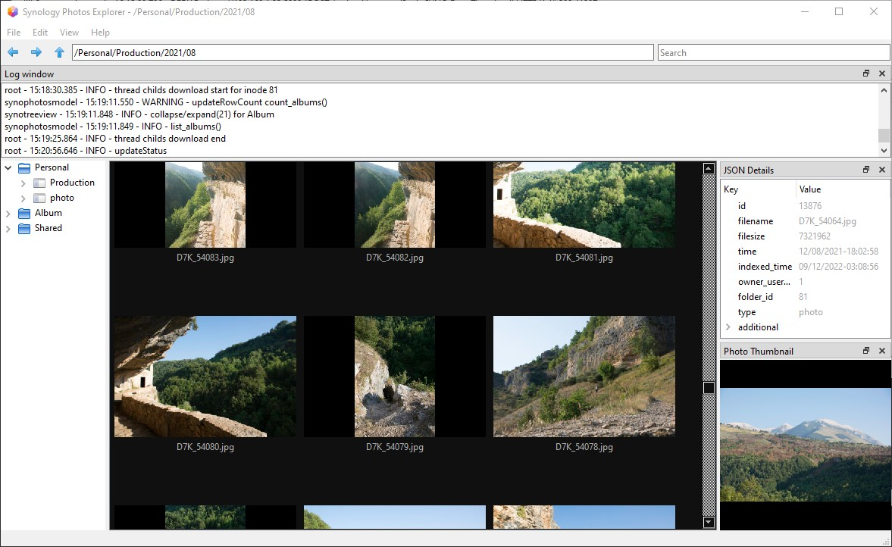

# synology-photos-explorer

An explorer application for Synology Photos using Python/Qt (PyQt6)
 
 

 

- Uses a modified version of the [Synology API](https://github.com/N4S4/synology-api) project. This version, embedded here, is stripped down to the essentials : APIS only for Synology Photos.

- Implements QAbstractItemModel and QStandardItem for TreeView / ListView with QSortFilterProxyModel

- Uses cache for thumbnails

- Program features :
  - download photos
  - view list personal tags, shared tags in Tab
  - search photos with tags, keywords in personal or shared space. Results are shown in Search Space 

## Configuration

- clone repository

- install python dependencies

        pip install -r requirements.txt

- Default login to Photo API is done via a .env file in the root directory.

  Prepare a ".env" file with the login parameters (avoid login dialog on start app) :

        SYNO_ADDR=...
        SYNO_PORT=...
        SYNO_USER=...
        SYNO_PASSWORD=...
        SYNO_SECURE=...
        SYNO_CERTVERIF=...
        SYNO_OPTCODE=...

- Launch application :

        python synophotosexplorer.py

## Settings

Some settings are only accessible via the registry (on Windows : HKEY_CURRENT_USER\SOFTWARE\fdenivac\SynoPhotosExplorer)
  "thumbcachepath" : cache folder (default: "./.cache_synophoto")
  "thumbcachesize" : maximum cache size in bytes (default=512 GB)

The registry is also used for store last folder opened, main windows position, current view (details, icons), docks positions, ...

## Contributing
You are welcome !